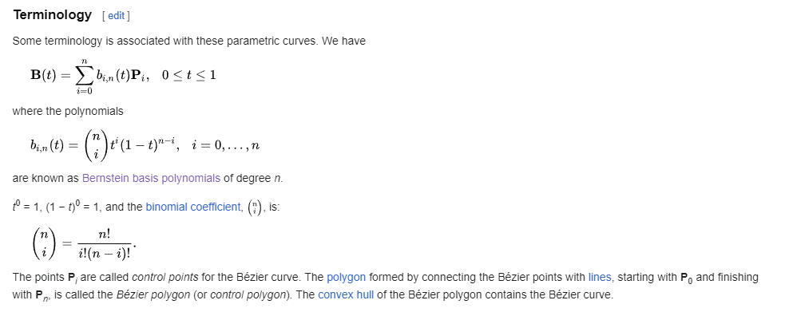
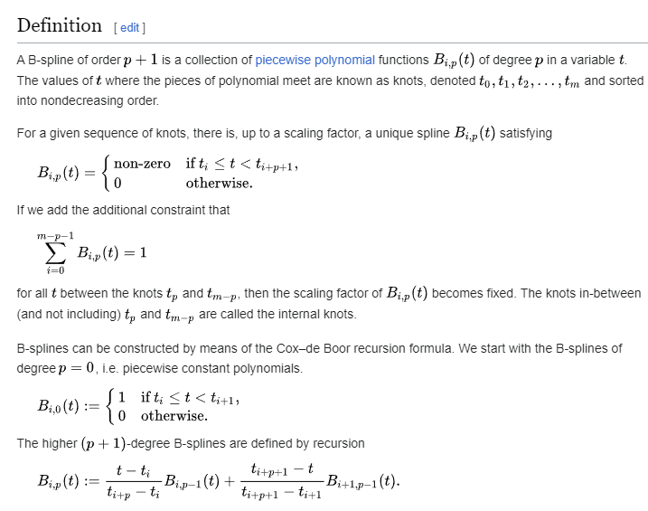

# Bezier Curve with Control Points

This project demonstrates how to create and interact with a Bézier curve using Pygame. Users can add control points, move them, and visualize a moving object that follows the curve. The speed of the moving object can be controlled using a slider.

## Features
- Add control points with a right-click.
- Move control points by dragging them with the left mouse button.
- Toggle between looping and non-looping
- Adjust the speed of the moving object
## Bernstein Based Bezier Formula

## Cox-de Boor

## App

